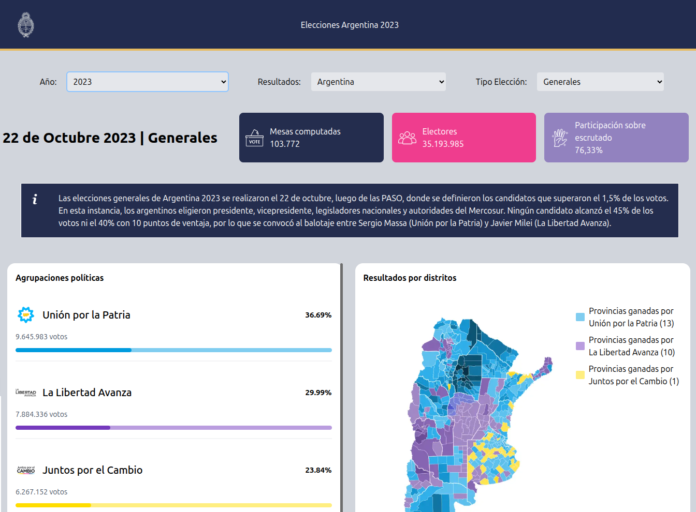

# 🇦🇷 Resultados Electorales Argentina 2023

Aplicación web desarrollada con **Next.js**, **TypeScript** y **TailwindCSS** que muestra los resultados electorales de Argentina por provincia y tipo de elección (Generales y Balotaje), con mapas interactivos y detalles de candidatos.

---

## 🚀 Tecnologías utilizadas

- [Next.js](https://nextjs.org/) – Framework React con SSR y rutas automáticas.
- [React](https://reactjs.org/) – Librería principal para la UI.
- [TypeScript](https://www.typescriptlang.org/) – Tipado estático para mayor seguridad.
- [Tailwind CSS](https://tailwindcss.com/) – Estilos rápidos y personalizables.
- [Recharts](https://recharts.org/) – Gráficos circulares para resultados de votación.
- Datos electorales simulados/locales en archivos JSON (`Generales.ts`, `Balotage.ts`).

---

## 📸 Vista previa



---

## 📦 Funcionalidades

- 📊 Mostrar resultados por **provincia** y **tipo de elección**.
- 🗳 Visualización de **mesas computadas, electores y participación**.
- 🏛 Mapas interactivos de las provincias con **Leaflet**.
- 🎯 Detalle de **candidatos presidenciales**, fotos, logos y descripción.
- 🟡 Gráficos circulares de votos (positivos, blancos, nulos e impugnados).
- 📱 Interfaz 100% **responsive**, adaptada a móviles, tablets y desktops.

---

## 🛠️ Instalación

1. Cloná el repositorio:

```bash
git clone https://github.com/Nicolas-Eliazer-Jara/resultados-electorales.git
cd resultados-electorales

Instalá las dependencias:

npm install


Iniciá el servidor de desarrollo:

npm run dev

📁 Estructura del proyecto

/app
├── component
│   ├── datosElectorales.tsx
│   ├── datosMap.tsx
│   ├── datosVotos.tsx
│   ├── footer.tsx
│   ├── form.tsx
│   ├── infoCandidatos.tsx
│   ├── infoEleccion.tsx
│   ├── main.tsx
│   └── nav.tsx
├── data
│   ├── Balotage.ts
│   ├── Candidatos.ts
│   └── Generales.ts

🙌 Autor

Hecho con 💻 por Nicolás Eliazer Jara – 2025